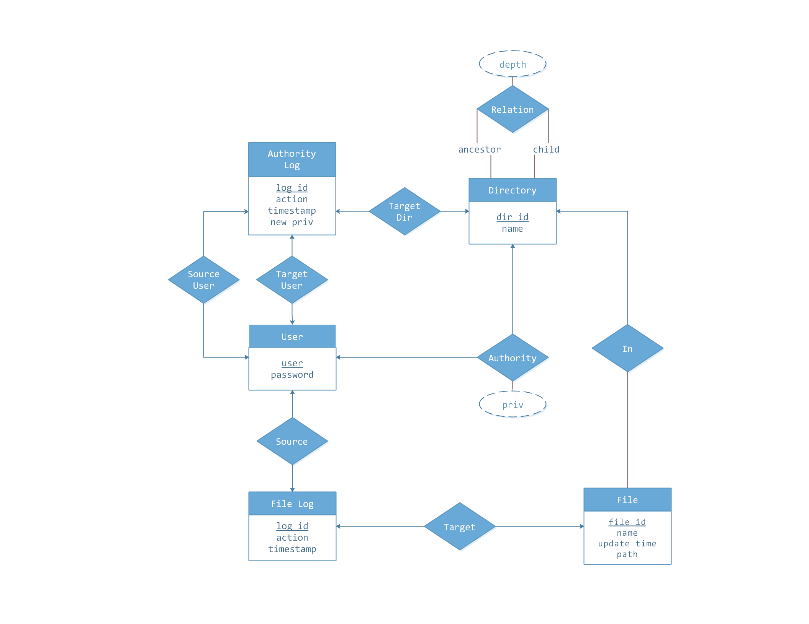

## 2018秋季学期数据库项目报告

数据科学与计算机学院  计算机科学与技术

刘梓晖(16337166) 區炜彬(16337202)


### 简介

我们的项目是基于关系型数据库MySQL做的一个简单的**web端云文件管理与共享平台**f。使用的Express框架搭建，UI使用了Semantic-UI。在建站中使用了nginx做端口代理。本篇报告将主要介绍所开发项目的主要功能，**着重讲述数据库部分的设计思想**，并简要概述网页设计以及网页效果。

**您可以通过访问http://cloud.alayse.org/来使用我们的项目。如果网页无法打开或出现任何Bug，请务必联系我们！**

项目源代码请查看https://github.com/kingiw/onlineFileSystem，里面包含了这个项目的**所有代码**以及我们**开发过程记录**（repo->insights）。


### 核心功能

##### 云端文件管理

用户在网站上拥有属于自己的一个简易文件系统，他们可以在其中创建文件夹，上传文件到云端，从云端上下载文件到本地。（但由于我们服务器硬件设备的限制，我们暂时只能够允许用户上传不大于1Mb的文件）

##### 文件共享

用户可以给其他用户以多种权限分享自己的一个或多个文件夹给其他用户。

在具体的使用中，用户A可以给用户B分享自己某个文件夹的**只读**权限，那么用户B将可以查看并下载该文件夹下的文件，但用户B并不能够上传自己的文件到该文件夹中。用户A也可以向用户B分享自己某个文件夹的**可写**权限，那么用户B不仅可以查看或下载该文件夹中的文件，还能够把自己的文件上传到该文件夹中。

**您可以查看附带在提交内容当中的GIF动图查看功能效果。也可以直接访问http://cloud.alayse.org/亲自试一试！**

### 数据库设计

#### E-R图

我们根据功能需求设计了如下的E-R图：



#### 数据库关系

在有了E-R图后，我们考虑使用关系型数据库来实现需要构建的数据库模型，同时我们把一些我们认为可以不必要的地方做了一些简易处理。

数据库中的关系包括以下若干。您可以直接查看`mysqldb.sql`获取更具体的信息。

##### User

定义了用户的用户名与密码。

```mysql
create table if not exists User(
    user varchar(255) not null,
    password varchar(255) not null,
    PRIMARY KEY(user)
);
```

##### Directory

定义了一个文件夹的信息。

```mysql
create table if not exists Directory(
    dir_id int not null,
    name varchar(255) not null,
    user varchar(255),
    PRIMARY KEY(dir_id),
    CONSTRAINT FK_Directory_User foreign key(user) references User(user) on delete set null
);
```

##### DirectoryRelation

这个关系用于记录一个文件夹的祖先文件夹以及其在文件夹树当中的深度，主要用于解决在关系型数据库中实现对树状数据结构的存储问题。后文有对此的详细解释。

```mysql
create table if not exists DirectoryRelation(
    dir_id int not null,
    ancestor int not null,
    depth int not null,
    PRIMARY KEY(dir_id, ancestor),
    CONSTRAINT FK_DR_D foreign key(dir_id) references Directory(dir_id) on delete cascade,
    CONSTRAINT FK_DR_A foreign key(ancestor) references Directory(dir_id) on delete cascade
);
```

##### File

定义用户上传的文件的信息。

```mysql
create table if not exists File(
    file_id int not null,
    name varchar(255) not null,
    update_time varchar(255) not null,
    user varchar(255),
    size int,
    path varchar(255),	-- The path that contains the file.
    PRIMARY KEY(file_id),
    CONSTRAINT FK_File_User foreign key(user) references User(user) on delete set null
);
```

##### FileInDirectory

记录File与Directory之间的关系，表示某个文件被存放在某个文件夹中。

```mysql
create table if not exists FileInDirectory(
    file_id int not null,
    dir_id int not null,
    PRIMARY KEY(file_id, dir_id),
    CONSTRAINT FK_FileInDirectory_File foreign key(file_id) references File(file_id) on delete cascade,
    CONSTRAINT FK_FileInDirectory_Directory foreign key(dir_id) references Directory(dir_id) on delete cascade
);
```

##### Privilege

记录每个用户对每一个文件夹的权限值。我们对于权限值的规定如下：

| 权限级别    | 允许动作                                                     |
| ----------- | :----------------------------------------------------------- |
| 不可读写(0) | 不可访问该文件夹的所有信息。                                 |
| 只读(1)     | 用户可以访问该文件夹下的所有信息, **但该文件夹下的子文件夹的访问权限由子文件夹决定**, 用户可以下载该文件夹下的所有文件。 |
| 可写(2)     | 包含只读权限下的所有动作, 且用户可以上传文件, 删除文件, 重命名子文件夹, **可以删除该文件夹下的子文件夹, 不管该用户对该子文件夹的权限如何**, 但不能删除该文件夹本身。 |
| 所有权(3)   | 包含可写权限下的所有动作, 且用户可以控制该文件夹的分享权限。默认只有文件夹的拥有者具有该权限，且该权限不可被分享。 |

其关系中的属性定义如下：

```mysql
create table if not exists Privilege(
    user varchar(255) not null,
    dir_id int not null,
    priv int,
    PRIMARY KEY(user, dir_id),
    CONSTRAINT FK_Privilege_User foreign key(user) references User(user) on delete cascade,
    CONSTRAINT FK_Privilege_Directory foreign key(dir_id) references Directory(dir_id) on delete cascade
);
```

##### FileLog

用于记录每一次上传/下载的日志。

```mysql
create table if not exists FileLog(
    log_id int not null,
    action char(10) not null,
    timestamp varchar(255) not null,
    user varchar(255),
    file_id int,
    PRIMARY KEY(log_id)
);
```

##### PrivilegeLog

用于记录每一次修改权限的日志。

```mysql
create table if not exists PrivilegeLog(
    log_id int not null,
    action char(10) not null,
    timestamp varchar(255) not null,
    newval int,
    dir_id int,
    user varchar(255),
    targetuser varchar(255),
    PRIMARY KEY(log_id)
);
```

#### 目录结构存储方式

文件系统的目录结构为一个树状结构，即每一个节点唯一的前继（根除外）和没有或一个或多个后继节点，在我们的实例中，一个文件夹即为一个树的节点（一个文件夹可能存在多个子文件夹）。接下来我们将简述在关系数据库中高效存放一个树状结构的方法。

##### 邻接表

一般情况下我们可以使用邻接表来存储一个树状结构，也就是保存有点以及其子节点的邻接关系的表。但是这种形式下，为了确定一个树状结构索引对应的节点，由于邻接表只存储当前节点以及其直接邻接的子节点。因此在查询子节点的邻接表前，我们是无法得知第二代子节点的。因此对于一个深度为$h$的节点的索引，一共需要进行$h$次查询，每次只为了获得某一个节点的邻接关系，对于一棵含有$n$个节点的树，其对应的平均查询次数为$O(log n)$，总的查询时间即为$O(hlogn)$。这样的查询方式效率是很低的，我们并没有采纳这种做法。

##### 闭包表

我们考虑采用闭包表的形式存储树结构。闭包表中每一个节点均记录其对应的闭包，也就是所有和这个节点有祖先和后代关系的节点。在闭包表中，要确定一个树状结构索引对应的节点，只需要先将索引转换为一个闭包，再通过查询该闭包就可以准确得到与之相符合的节点。在我们的数据库模型中，闭包表可以将查询次数降低为两次，也就是$O(1)$。第一次通过名字以及对应的深度预筛选获得可能的节点列表，第二次查询获取这些节点对应的闭包，由于我们已经拥有一份明确的节点列表，因此多个节点的闭包也可以在一次查询中获取。随后比对这些节点的闭包和索引闭包，就能准确找到目标节点。

由于在我们的数据库模型中，同一节点的子节点不允许出现重名的节点，不同节点的闭包必然是不同的。因此可以确保闭包表能获取准确的节点。


### 前端与后端的搭建

我们的网站采用的Nodejs(Express)+SQL的框架，前端UI使用Semantic-UI，使用nginx做了反向代理。由于与网站相关的技术与本门课程没有太多关联，在这里我们仅简单对我们所使用的一些工具和基本方法做介绍。

##### 前端模版渲染

模板渲染框架采用了nodejs自带的[express-handlebars](https://www.npmjs.com/package/express-handlebars)实现。

```javascript
let exphbs = require('express-handlebars'); // 引用express-handlebars库
//声明模版引擎
app.engine('hbs', exphbs({
    layoutsDir: 'views',	//模板文件的路径
    defaultLayout: 'layout', //默认layout的文件名
    extname: '.hbs' //模板文件的拓展名
}));
app.set('view engine', 'hbs');
```

这里详述一下`defaultLayout`。它表示一个“框架文件”，每次渲染模板时，都会把内容放入到`{{body}}`部分。

```html
<!-- views/layout.hbs -->
<!DOCTYPE html>
<html>
<head>
    <!-- HTML的默认配置信息，样式表信息 -->
</head>
<body>
    <div class="ui container"> <!-- Semantic UI 框架的最外层DOM-->
        {{{body}}}
    </div>
</body>
<!-- 一些Js脚本信息 -->
</html>
```

在Express下重新声明模板渲染的机制，在每次加载网页时都会重新渲染模板。详情请看代码。

##### 登录账户的cookie

为了提高用户体验，我们专门通过在app中声明一个session来维护登录账户的cookie以实现短期内免密登录。

```javascript
app.use(session({
    name: identityKey,
    secret: 'signature',    //用来对session id相关的cookie进行签名
    store: new FileStore(), //本地存储session
    saveUninitialized: false,   // 是否自动保存为初始化会话
    resave: false,  //是否每次都重新保存会话
    cookie: {
        maxAge: 3600 * 1000   // 有效期，单位毫秒
    }
}))
```


##### 上传与下载文件

上传我们使用了node.js自带的[multer](https://www.npmjs.com/package/multer)库来实现文件传输。

下载则是通过Express的[res.download](https://expressjs.com/en/api.html)方法实现。

您可以查阅代码来了解他们的用法。

##### 密码的处理

根据老师上课所说，我们没有在数据库中直接存用户的密码明文，而是存储了md5加密后的密文。这样防止数据库信息被盗取时导致用户密码的明文泄漏。另外，为了避免用户使用常见密码，导致可以使用某些md5 cracker破解，每次处理对密码进行加密时是使用“账户+密码”相连：

```javascript
let password = encrypt.md5(req.body.username + req.body.password);
```

##### nginx配置

因为反向代理不是本课程的主要内容，在这里不赘述。我们参考了相关资料，对服务器进行配置。配置文件如下：

```nginx
server {
    # the port your site will be served on
    listen 80;
    # the domain name it will serve for
    server_name cloud.alayse.org; # substitute your machine's IP address OR FQDN
    charset utf-8;
    # max upload size
    client_max_body_size 75M; # adjust to taste
    # Send all requests to the Express server
    location /{
        proxy_pass http://localhost:8100/; # Express backend is run on port 8100
    }
}
```


### 待改进工作

1. 暂时不支持对文件的删除功能。
2. 暂时不支持用户组操作。
3. **不支持中文文件名与文件夹名! 请不要尝试上传中文文件名的文件。**
4. 使用分布式数据库提高项目的可适用程度。
5. <del> 买更好的服务器。</del>

### 队员分工

刘梓晖：负责提出项目设想，网站前端设计，网站后端接口设计。

區炜彬：负责对数据库的设计，为网站后端提供了数据库读写API，负责服务器端项目部署工作。

### 网站展示

您可以查看提交内容中附带的GIF动图了解网站功能。

您也可以访问http://cloud.alayse.org/来亲自尝试一下。我们事先在网站中准备了一些帐号供使用，账号名分别为`bob`，`alice`， `john`，他们的登陆密码都是`123456`。当然您也可以注册您自己的账户。我们还在里面埋下了一些彩蛋。

### 项目感想

<del>这是一门名叫“数据库原理”，实践是“Web开发”的课。在做项目的过程中我们几乎把90%的时间都用来研究建站上了。</del>

在一开始我们是考虑使用MongoDB，主要是因为MongoDB是一个轻量级费关系型数据库，对存储数据的模型不会像关系型数据库那样死板，最能体现这一点的就是在“存树结构”上。然而鉴于本课介绍的是关系型数据库，我们最终还是选择把MySQL作为我们项目的数据库。

我们更多时候觉得，在使用MySQL DBMS下，只要做好了数据库中实体与他们之间的联系关系，开发时我们更多会关注的是后端的逻辑与前后端的交互。数据库在构建项目的过程中并不是一个难点。但即便如此，在这个项目中我们也是实实在在地接触到了关系型数据库的设计，尝试在实践中使用ER图来可视化关系模型，进一步地熟练了与数据库相关的概念与操作，甚至对MySQL的运作乃至背后的优化机理有了一定程度的了解。但比较遗憾的是我们并没有能够在实践当中体会到关系型数据库的优势在于维持高并发状况下数据库的ACID特性（因为并不可能会有成百上千人同时访问我们的网站）（笑）。

尽管我们已经做过很多测试，但因为这个项目完全是从零做起的，只是一个简易的demo，且同时我们的服务器确实也比较渣，所以我们不确保网站会不会因为突然出现意料之外的问题。如果遇到问题，恳请您原谅。

### 参考

《数据库系统概念》*Abraham Silberschatz* 等。

[relational database vs non-relational database](https://www.pluralsight.com/blog/software-development/relational-non-relational-databases)

[MySQL](https://www.mysql.com/)

[Express 4.x API documentation](https://expressjs.com/en/api.html)

[Semantic UI](https://semantic-ui.com/)

[Wikipedia: Entity-relationship model](https://en.wikipedia.org/wiki/Entity%E2%80%93relationship_model)

[Nginx 反向代理配置和工作原理](https://ketao1989.github.io/2015/08/30/nginx-proxy-configure-and-sduty/)


